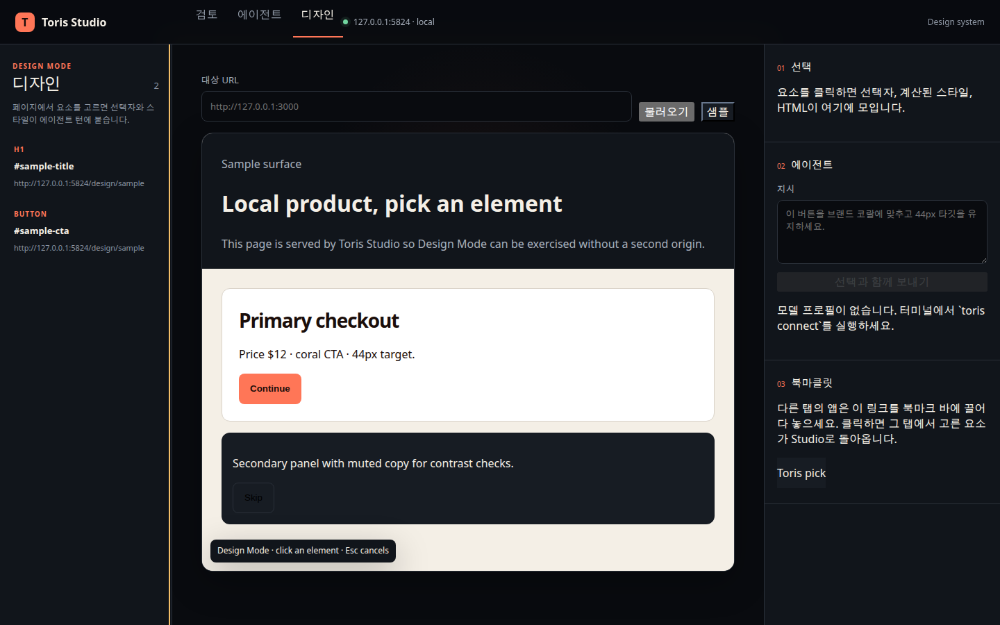
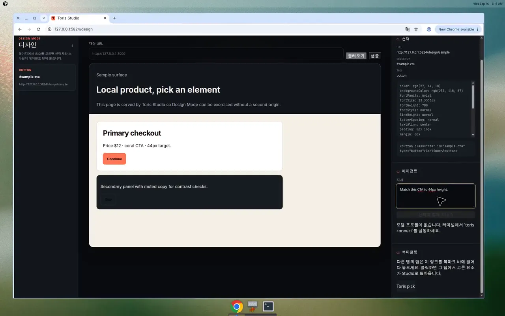
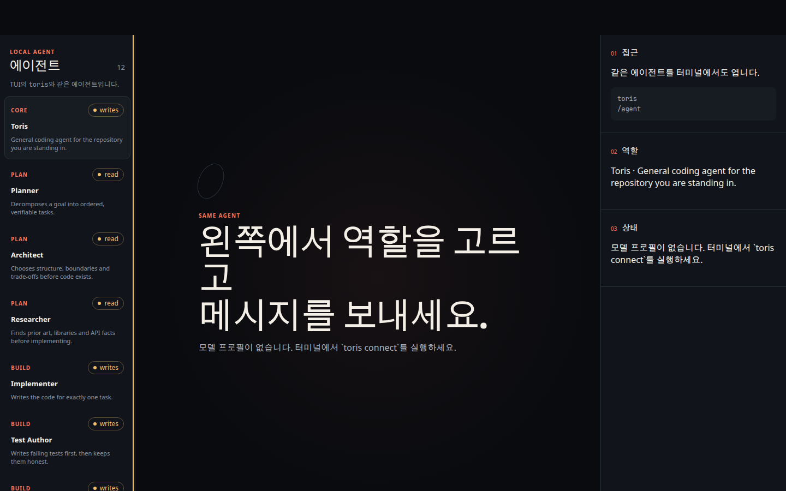
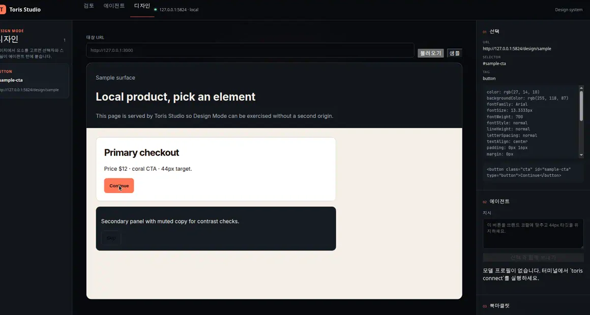
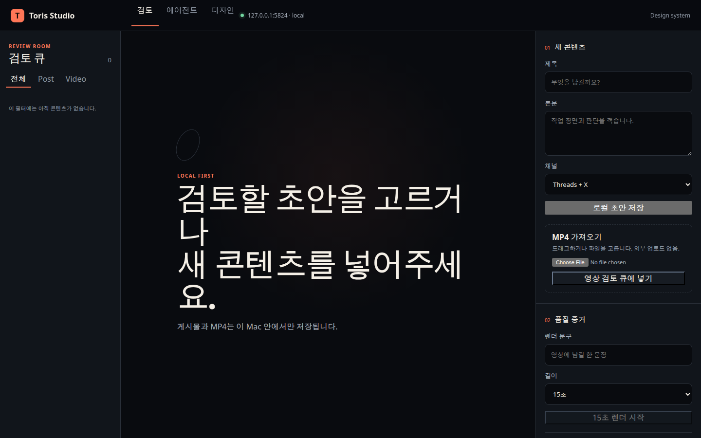

<div align="center">

# Toris Agent

**A local-first ADE and agent harness for solo builders.**

Turn one goal into planned, executed, and verified work — on your machine, with a receipt you can read.

[](https://github.com/torisKR/toris-agent/actions/workflows/ci.yml)
[](https://www.npmjs.com/package/toris-agent)
[](https://nodejs.org)
[](./LICENSE)
[](./package.json)

</div>

<p align="center">
  
</p>

Toris is a *harness*, not a model. Your [Claude Code](https://claude.com/claude-code) or [Codex](https://developers.openai.com/codex/cli) CLI does the thinking. Toris decides **what** gets thought about, **in what order**, **how much may happen without you**, and **whether it actually worked**.

```console
$ toris run "add a health endpoint" --dry-run

Run (dry-run)
  goal      add a health endpoint
  autonomy  L3
  mode      dry-run (plan only, nothing executes)

  Tasks (2)
  #  AGENT        STATUS   TITLE
  1  implementer  pending  Implement: add a health endpoint
  2  test-author  pending  Add tests covering the change
```

With a provider CLI the planner writes richer task titles. Without one, `--dry-run` still produces a deterministic fallback plan — that is the sample above.

Nothing leaves `~/.toris`. There is no Toris account, no hosted control plane, and no telemetry of its own.

---

## Design Mode in 36 seconds

Pick a live DOM element. Attach the selector, computed styles, bounded HTML, and a cropped screenshot to the same coding agent you already use in the terminal.

<p align="center">
  <a href="docs/assets/readme/design-mode-demo.mp4">
    
  </a>
</p>

<p align="center">
  <a href="docs/assets/readme/design-mode-demo.mp4">Play the Design Mode demo (H.264 MP4)</a>
  ·
  <a href="docs/assets/readme/design-mode-demo.mp4"><code>docs/assets/readme/design-mode-demo.mp4</code></a>
</p>

GitHub does not always inline a repository MP4 inside the README. The poster above links to the file; the plain path works in the blob viewer.

Screenshots, the poster, and the demo were captured from a running Toris Studio at `http://127.0.0.1:5824`. Assets live in [`docs/assets/readme/`](docs/assets/readme/).

---

## Why solo builders use it

| Principle | What it means |
| --- | --- |
| **Local-first** | Every run, event, patch, Design Mode capture, and Android screenshot is a plain file under `~/.toris`. |
| **Evidence over vibes** | A run is not done because an agent said so. It is done when *your* `lint` / `test` / `build` pass — and the receipt shows the exit codes. |
| **A model does not grade its own homework** | After `claude` or `codex` implements, the other CLI reviews the isolated diff. A fail verdict holds auto-apply. `--no-review` skips it. |
| **Autonomy is a dial** | L1 plans and touches nothing. L5 commits and pushes, including the default branch. Default is **L3**. |
| **Zero runtime dependencies** | The Node runtime is the standard library. Your supply chain is you, Node, and the provider CLI you already installed. |

---

## Features

### Same agent in the terminal and in Studio

<p align="center">
  
</p>

`toris` opens the chat TUI. `toris studio` opens the localhost GUI. `toris studio --open` starts or attaches and opens the loopback URL so you do not copy it. `/studio` in the TUI does the same jump when Studio is already up. `/agent` in either place is the same catalogue: the `toris` coding persona plus eleven task roles. Studio agent turns stream live over SSE when the browser sends `Accept: text/event-stream`.

```bash
toris                     # TUI chat
toris --agent implementer
toris studio --open       # http://127.0.0.1:5824
                          # agent room  /agent
                          # Design Mode /design
                          # Patch Review /patches
                          # knowledge   /knowledge
                          # daemon      /daemon
                          # brief       /brief
                          # android     /android
```

### Design Mode — UI evidence on the agent turn

<p align="center">
  
</p>

Open `http://127.0.0.1:5824/design`, load your localhost app (or the built-in sample), click elements into the annotation tray, attach optional per-element notes, write one instruction, send. Studio stores captures under `~/.toris/studio/design/` (`des_*.json`, optional PNGs, and `tray.json`) and attaches the whole tray to a single `POST /api/agent/turn`.

There is no bundled Chromium and no extra npm dependency. Studio proxies `http`/`https` pages into a sandboxed iframe (`sandbox="allow-scripts"`, no `allow-same-origin`), or you drag the **Toris pick** bookmarklet onto pages that cannot be framed. Details: [docs/STUDIO.md](docs/STUDIO.md).

### Patch Review — isolated diffs without leaving Studio

After Design Mode or an agent run, open `http://127.0.0.1:5824/patches`. Pending records from the existing `toris patches` store show metadata and a bounded unified diff. Apply, discard, or send a short review note (and an optional selected hunk) back as an implementer turn — that turn runs in the isolated worktree and refreshes the stored diff before you apply. Mutations use the same Origin + session token as the rest of Studio. `toris apply` / `toris discard` stay as they are.

### Optional Android verification

Shipping Expo or Flutter to a phone is optional for the rest of Toris. When you do, `adb` on `PATH` is enough:

```bash
toris doctor                 # WARN if adb/emulator are missing — does not fail the run
toris android status         # adb + emulator presence, connected devices
toris android devices
toris android screenshot     # PNG under ~/.toris/android/screenshots/
toris android logcat         # dump under ~/.toris/android/logs/
toris android install app.apk
```

Chat gets an `android` tool (`status`, `devices`, `screenshot`, `logcat`) so the model can attach device evidence before claiming a mobile UI fix. Studio `/android` is the same local evidence surface (status, devices, screenshot, recent artifacts) and can attach a selected screenshot and/or logcat excerpt to one `POST /api/agent/turn`. `install` stays CLI-only. No Android SDK is required for Studio, chat, or `toris run`.

### Secretary knowledge — domains, DAG, tacit memory

The agent should get better at *your* work over time. `toris knowledge init` seeds a local store at `~/.toris/knowledge/`: bounded `USER.md` / `MEMORY.md`, starter domain packs (product growth, Flutter/Expo Android, Toris ops, solo revenue), and a DAG between knowledge nodes. Install one smaller shipped pack without init via `toris knowledge pack install <slug>` or Studio `/knowledge` — never auto-installed on first run, and never writes `USER.md` / `MEMORY.md`. Search is keyword + tag. Each `toris chat` turn (and Studio agent turns) auto-retrieves matching domain nodes and tacit notes into a bounded `[knowledge context]` block — no manual search required. Disable with `toris chat --no-knowledge` or `knowledge.autoRetrieve: false` in `config.json`. Writes are gated like other mutating chat tools (ask below L3). After a verified run, `/reflect` or `toris knowledge reflect <runId>` proposes a tacit note from the receipt (goal, plan titles, check exits) — it does not write silently. `--json` returns the draft only. Studio `/knowledge` can Accept that same verified-run proposal (Origin + session token); Dismiss does not write. Auto-retrieve never writes.

`toris brief` is the one-screen morning read of the same stores: today's spend, today's runs, whether the daemon is up, and a few tacit/node headlines. It skips the knowledge block if you have not run `toris knowledge init`. The same digest is on the loopback GUI at `http://127.0.0.1:5824/brief`, where you can also set or clear today's daily cost budget (`maxDailyCostUsd`). Details: [docs/KNOWLEDGE.md](docs/KNOWLEDGE.md) and [docs/BRIEF.md](docs/BRIEF.md). Studio browse/add is at `http://127.0.0.1:5824/knowledge`, including a read-only DAG of the selected domain. Check **use on next turn** on a DAG node to pin that stored note onto the next Studio agent turn.

### Daemon — worker status without the CLI

`http://127.0.0.1:5824/daemon` shows the same local facts as `toris daemon status`: running or not, pid, uptime, heartbeat, next due schedule, the schedule list, and recent jobs from `daemon-jobs.json`. Enable, disable, remove, and add a schedule through the existing store (Origin + session token). **Queue run** posts the same one-shot inbox job as `toris daemon run` (`POST /api/daemon/run`); a down worker is HTTP 503 (CLI exit 5). Studio does not start or stop the worker. See [docs/DAEMON.md](docs/DAEMON.md).

### Review room for local drafts

<p align="center">
  
</p>

Studio also reviews Korean post drafts and vertical MP4s on loopback. External publishing is disabled. Mutations need the current local `Origin` plus an in-memory session token. The server binds only to `127.0.0.1`.

---

## Requirements

- **Node.js >= 22.6.0** (`node --version`)
- At least one provider CLI on `PATH` to *execute* runs:
  - [Claude Code](https://claude.com/claude-code) — `claude`
  - [Codex CLI](https://developers.openai.com/codex/cli) — `codex`
- `git` (optional, but required for commit/push autonomy)
- `adb` (optional; Android verify only)
- Studio video render on macOS: `uv` and `ffmpeg` on `PATH`

`toris doctor` names whatever is missing. Planning (`--dry-run`) still works without a provider CLI.

---

## Install

```bash
# Global CLI (recommended)
npm install -g toris-agent
toris --help

# One-off, no install
npx toris-agent doctor

# Latest unreleased code, straight from git
npm install -g git+https://github.com/torisKR/toris-agent.git

# From source — there is no install step; there are no dependencies
git clone https://github.com/torisKR/toris-agent.git
cd toris-agent
npm link
toris doctor
```

Uninstall with `npm uninstall -g toris-agent`.

### Update

```bash
toris update            # fetch the latest published version and install it in place
toris update --check    # only report whether a newer version exists
toris update --json     # machine-readable result
```

`update` detects how this copy was installed before it changes anything. A global npm install is upgraded with `npm install -g toris-agent@latest`; pnpm, yarn, and bun installs get their own manager's command. A git checkout or a local project dependency is never overwritten — Toris prints the command it would have run and leaves the decision to you.

---

## Quickstart

**1. Check the environment.**

```console
$ toris doctor
toris doctor

  PASS  node               v22.14.0 (requires >= 22.6.0)
  PASS  provider:claude    /usr/local/bin/claude
  PASS  git                /usr/bin/git
  WARN  config             not created yet, run: toris init
  PASS  store              ~/.toris
  WARN  adb                adb not on PATH; Android verify is optional
  WARN  emulator           emulator not on PATH; device or Expo Go is enough
```

**2. Initialise and register the repo you are standing in.**

```bash
toris init
toris project add .
```

**3. Plan without touching anything.**

```bash
toris run "add a health endpoint" --dry-run
```

**4. Raise the dial when you trust the plan.** Default autonomy is L3 (apply + local commit, ask before push):

```bash
toris run "add a health endpoint" --autonomy L3 --budget 2.00
```

**5. Read the evidence.**

```bash
toris runs
toris inspect <runId>
toris receipt <runId> --md > receipt.md
toris cost                    # today vs maxDailyCostUsd, recent days
toris brief                   # one-screen digest (spend, runs, daemon, knowledge)
```

---

## Design Mode workflow

1. Start Studio: `toris studio --open` → Design Mode is at `http://127.0.0.1:5824/design`.
2. Load a target URL, or click **샘플** for the built-in page at `/design/sample`.
3. Click elements into the tray. Studio records CSS selector, bounded `outerHTML`, computed styles, page URL, a cropped screenshot when the browser can rasterize it, and an optional per-element note.
4. Write one instruction (“match these to 44px height”) and send the whole tray on a single coding-agent turn.
5. Open `/patches` to read the isolated diff, leave a review note, then apply or discard. Re-check in Design Mode or with `toris android screenshot` if you ship to a device.
6. For authenticated SPAs or strict CSP, drag **Toris pick** to the bookmark bar, pick in the app tab, and Studio opens `/design#ingest=...` on loopback.

The proxy only fetches `http`/`https`, strips a target CSP, and frames the result with `frame-ancestors 'self'`. Untrusted scripts run without `allow-same-origin`, so they cannot read the Studio session token.

---

## Architecture

<p align="center">
  
</p>

- **Planner** (`src/core/planner.js`) turns one sentence into ordered tasks, each bound to an agent profile.
- **Orchestrator** (`src/core/orchestrator.js`) runs independent tasks in parallel (default 3), retries failures (default 2), and falls back to the *other* provider before giving up.
- **Worktrees** (`src/core/worktree.js`) keep coding CLIs out of your checkout. Applying the diff is a separate gate (`toris patches` / `apply` / `discard`).
- **Verifier** (`src/core/verifier.js`) infers checks from your `package.json` scripts and runs them for real. It stops at the first failure so a broken build does not burn the rest of your budget.
- **Receipt** (`src/core/receipt.js`) records goal, plan, per-task status, check exit codes, duration, and cost. Exit code `3` means verification failed — CI can gate on it.
- **Cost ledger** (`src/core/cost.js`) aggregates those per-run totals under `~/.toris/cost.json` and enforces `maxDailyCostUsd` across runs (plus `--budget` on a single run).

The frozen v0.1.0 interface lives in [docs/CONTRACT.md](docs/CONTRACT.md). Studio behaviour is in [docs/STUDIO.md](docs/STUDIO.md). Module specs are under [docs/specs/](docs/specs/).

---

## Chat

`toris run` delegates to agent CLIs. `toris chat` talks to a model with tools, so you can work without a second CLI installed.

Toris ships **no model IDs**. You own that mapping:

```jsonc
// ~/.toris/config.json
"models": {
  "profiles": { "main": { "provider": "anthropic", "model": "<model-id>" } },
  "routing":  { "chat": "main" }
}
```

HTTP providers: `anthropic`, `openai`, `grok`. CLI-backed: `claude-cli`, `codex-cli`. Grok uses `XAI_API_KEY` (`GROK_API_KEY` also works):

```bash
export XAI_API_KEY=...
toris connect --provider grok --model <grok-model-id>
export ANTHROPIC_API_KEY=...      # or OPENAI_API_KEY
toris chat                        # REPL
toris chat "why does the build fail?"
```

The model gets `read_file`, `list_files`, `write_file`, `run_command`, and `android`. Writes and commands are gated by autonomy — below **L3** every mutation asks first, and a denial is reported back to the model instead of silently failing.

If chat is not usable yet, `toris doctor` names the exact key or variable to set.

---

## Skills

A skill is a directory with a `SKILL.md`. Discovery is **builtin → `~/.toris/skills` → `<project>/.toris/skills`**. Later definitions override earlier ones by name.

```console
$ toris skills
Skills (11)

  NAME                                SOURCE   DESCRIPTION
  android-verify                      builtin  Capture Android device evidence before claiming a mobile UI fix.
  app-store-listing-creator           builtin  Create or improve Play Store and App Store listing packages.
  expo-android-performance            builtin  Diagnose and optimize Expo Android performance.
  expo-interactive-design             builtin  Design distinctive Expo interfaces and motion.
  flutter-android-performance         builtin  Diagnose and optimize Flutter Android performance.
  flutter-interactive-design          builtin  Design distinctive Flutter interfaces and motion.
  release-check                       builtin  Verify a package is actually installable and runnable before publishing or tagging.
  reproduce-first                     builtin  Reproduce a bug with a command before proposing any fix.
  seo-geo-optimizer                   builtin  Audit and improve technical SEO, GEO, and llms.txt.
  ship-small                          builtin  Land the smallest change that fully solves the problem, with proof it works.
  toris-flutter-play-store-release    builtin  Operate Flutter Android delivery through Fastlane and GitHub Actions.
```

Three built-ins encode habits that are easy to skip when you are the only reviewer: reproduce before fixing, ship the smallest change, and prove the package installs before tagging a release. The rest come from [product-growth-skills](https://github.com/torisKR/product-growth-skills).

---

## Autonomy

Every run has a ceiling. Coding CLIs write in a disposable git worktree, not your checkout.

```console
$ toris autonomy
Autonomy levels

  LEVEL  WRITE  APPLY  COMMIT  PUSH  MEANING
  L1     no     no     no      no    plan only
  L2     yes    no     no      no    edit isolated worktree, ask before applying
  L3     yes    yes    yes     no    apply to the repo, commit locally, ask before push
  L4     yes    yes    yes     yes   push to a side branch
  L5     yes    yes    yes     yes   fully autonomous, including the default branch
```

Default is **L3** (`defaultAutonomy` in `~/.toris/config.json`). At L2 a finished run exits `4` with status `awaiting-apply` until you decide:

```bash
toris patches
toris apply pat_7x2k9d
toris discard pat_7x2k9d
toris run "fix the parser" --apply   # L2, but apply without asking
```

Push and other gated actions still queue as approvals:

```bash
toris approvals
toris approve apr_7x2k9d
toris reject  apr_7x2k9d
```

---

## Agent profiles

`toris agents` lists **12** profiles: the `toris` chat persona (`core`) plus eleven task roles. `WRITES` marks the ones allowed to modify files.

```console
$ toris agents
Agent profiles (12)

  ID                 CATEGORY  WRITES  SUMMARY
  toris              core      yes     General coding agent for the repository you are standing in.
  planner            plan      no      Decomposes a goal into ordered, verifiable tasks.
  architect          plan      no      Chooses structure, boundaries and trade-offs before code exists.
  researcher         plan      no      Finds prior art, libraries and API facts before implementing.
  implementer        build     yes     Writes the code for exactly one task.
  test-author        build     yes     Writes failing tests first, then keeps them honest.
  refactorer         build     yes     Removes duplication and dead code without changing behaviour.
  code-reviewer      review    no      Reviews a diff for correctness, clarity and contract drift.
  security-reviewer  review    no      Audits for secrets, injection, authz and unsafe file/network use.
  verifier           verify    no      Runs the project checks and reports pass/fail with evidence.
  doc-writer         ship      yes     Updates README, changelog and usage docs to match reality.
  release-manager    ship      yes     Prepares version bumps, changelogs and release notes.
```

Filter with `toris agents --category build`.

Add a domain specialist without forking Toris: drop one JSON file per role in **`.toris/agents/<id>.json`**, or **Create** that same file from Studio `/agent`. The same id replaces a built-in; a new id appears in `toris agents`, `/agent`, `--agent`, Studio, and planner assignment. Optional overlay: `~/.toris/agents/` (home, then project wins — same order as skills). Studio create is project-local only. Bad files fail with a path and a field error, not a stack trace. See [docs/AGENTS.md](docs/AGENTS.md).

---

## Receipts

Every run produces an auditable record. Markdown for humans, JSON for machines.

```bash
toris receipt <runId>          # JSON on stdout
toris receipt <runId> --md     # Markdown, ready to paste into a PR
toris logs <runId>             # raw JSONL event stream
toris cost                     # spend by day and recent runs
toris cost today --json
toris brief                    # today: spend, runs, daemon, knowledge headlines
toris brief --json
```

`maxDailyCostUsd` (default `20`) is a local daily ceiling. A new run is refused — with a CLI error and a receipt note — when today's spend is already at the cap. Mid-run, remaining tasks and the opposite-provider review stop cleanly instead of crossing the ceiling. `--budget` is still the per-run cap. Set either value to `0` for unlimited. Days follow the machine's local calendar, not UTC. Nothing is sent off-box.

---

## Slack and Telegram

`toris bot` long-polls Telegram and opens Slack Socket Mode. Coding work from a messenger always goes through `/run` (isolated), never through free-form chat.

```bash
export TORIS_TELEGRAM_BOT_TOKEN=...
export TORIS_SLACK_BOT_TOKEN=xoxb-...
export TORIS_SLACK_APP_TOKEN=xapp-...   # Socket Mode
# optional outbound-only: TORIS_SLACK_WEBHOOK_URL

toris bot
```

From Slack or Telegram: `/run`, `/patches`, `/apply`, `/last`, `/discard`, `/status`, `/workspace`, `/projects`, `/runs`, `/receipt`, `/autonomy`.

Restrict senders with `channels.telegram.allowFrom` / `channels.slack.allowFrom`. Pin the repo with `channels.workspace` or `/workspace`.

---

## Background daemon

A local worker so a queued `run` can outlive a TUI session. It is **not** a cloud service, not multi-machine, and it does not open a network port.

```bash
toris daemon start
toris daemon status          # running/not, pid, uptime, next schedule, ~/.toris
toris daemon status --json
toris daemon run "add a health endpoint" --dry-run
toris daemon schedule add "@daily" "add a health endpoint" --dry-run
toris daemon schedule list
toris daemon stop
```

`start` writes `~/.toris/daemon.lock` + `daemon.json` and refuses a second start while that pid is alive. `run` drops a job in `~/.toris/daemon/inbox/` for the worker to execute with the same orchestrator as `toris run`. If the daemon is down, `daemon run` exits `5`.

Schedules are **local cron only** (5-field cron, `@hourly`/`@daily`/`@weekly`/`@monthly`, `@every 15m`, or `09:00 mon-fri`). The worker evaluates due items on its heartbeat in the machine timezone and enqueues the same inbox jobs as `daemon run`. The same schedule does not double-fire while a prior job is still queued or running. There is no cloud calendar and no remote multi-machine clock. Studio `/daemon` is a loopback view of the same store, including a one-shot Queue run form. See [docs/DAEMON.md](docs/DAEMON.md).

`toris brief` is a foreground CLI, not a daemon job. Do not `daemon schedule add "09:00" "toris brief"` — that would be a coding goal (and is refused). Put `toris brief` on host cron / systemd / launchd instead. See [docs/BRIEF.md](docs/BRIEF.md).

`toris run` itself still executes in the foreground. Unix-socket RPC (`daemon.sock`) and remote supervisors are not in this release.

---

## Command reference

```
init                      Create ~/.toris and a default config
doctor                    Check runtime, providers, git and store
connect                   Connect a model backend (CLI login or API key)
chat ["<message>"]        Talk to a model with tools (REPL if no message)
project add [path]        Register a project (defaults to cwd)
project list | inspect <id> | remove <id>
run "<goal>"              Plan and execute a goal
runs | inspect <runId> | receipt <runId> [--md] | cost [today] | brief [today] | logs <runId> | cancel <runId>
approvals | approve <id> | reject <id>
agents [--category <c>]   Profiles (builtins + .toris/agents/*.json)
skills                    Skill packages the model follows in chat
autonomy                  Autonomy levels and what each permits
daemon start|stop|status  Local background worker (pid/lock under ~/.toris)
daemon run "<goal>"       Queue a run while the daemon is up (exit 5 if down)
daemon schedule           Local cron: list | add | remove | enable | disable
studio                    Local GUI on 127.0.0.1:5824 (review, /agent, /design, /patches, /knowledge, /daemon, /brief, /android)
studio service <action>   macOS LaunchAgent: install | status | restart | uninstall
android status|devices|screenshot|logcat|install
knowledge                 Local secretary store: init, domains, node, tacit, search, reflect
bot                       Listen for Slack and Telegram commands
patches | diff <patchId> | apply <patchId> | discard <patchId>
update [--check]          Update toris to the latest published version
version                   Print version
```

**Run options**

| Flag | Meaning |
| --- | --- |
| `-p, --project <ref>` | Project id, name or unique prefix |
| `--autonomy <L1..L5>` | How much may happen unattended (default `L3`) |
| `--budget <usd>` | Cost ceiling for this run |
| `--dry-run` | Plan only; never edits files |
| `--apply` | Apply an isolated L2 diff without asking |
| `--no-review` | Skip the opposite-provider second pass |
| `--provider <name>` | `claude` or `codex` |

**Global options**

| Flag | Meaning |
| --- | --- |
| `--json` | Machine-readable output on stdout |
| `--home <dir>` | Override `~/.toris` |
| `--no-color` | Disable ANSI colour |
| `--verbose` | Stream events as they happen |

**Exit codes**

| Code | Meaning |
| --- | --- |
| `0` | ok |
| `1` | failure |
| `2` | usage error |
| `3` | verification failed |
| `4` | approval denied |
| `5` | daemon unavailable |

```bash
toris run "$GOAL" --autonomy L3 --json > run.json || exit $?
toris receipt "$(jq -r .run.id run.json)" --md >> "$GITHUB_STEP_SUMMARY"
```

---

## Configuration

State lives under `$TORIS_HOME` (default `~/.toris`) as plain text:

```
~/.toris
├── config.json
├── projects.json
├── cost.json               # daily spend ledger (local calendar date)
├── knowledge/              # USER.md, MEMORY.md, domain DAGs, tacit notes
├── runs/
├── events/
├── studio/design/          # Design Mode captures + tray.json
├── daemon.json             # local daemon pid, heartbeat, job counts
├── daemon.lock             # exclusive owner lock (refuses double-start)
├── daemon/inbox/           # queued jobs from `toris daemon run` and schedule ticks
├── daemon/schedules/       # one JSON file per local cron schedule
├── daemon-jobs.json        # worker-owned job history
├── logs/daemon.log         # detached worker stdout/stderr
├── patches.json            # isolated diffs waiting for apply/discard
├── patches/                # pat_*.diff files
└── android/                # optional adb screenshots and logcat
```

`toris init` writes:

```json
{
  "version": 1,
  "defaultAutonomy": "L3",
  "maxParallelAgents": 3,
  "maxDailyCostUsd": 20,
  "maxRetriesPerTask": 2,
  "providerTimeoutMs": 900000,
  "defaultProvider": "claude",
  "providers": {
    "claude": { "bin": "claude", "enabled": true },
    "codex": { "bin": "codex", "enabled": true }
  }
}
```

Unknown keys are preserved, so a newer config survives an older binary.

| Variable | Effect |
| --- | --- |
| `TORIS_HOME` | Override the state directory |
| `TORIS_CLAUDE_BIN` | Path to the `claude` executable |
| `TORIS_CODEX_BIN` | Path to the `codex` executable |
| `TORIS_DEBUG` | Verbose internal logging |
| `TORIS_TELEGRAM_BOT_TOKEN` | Telegram bot token for `toris bot` |
| `TORIS_SLACK_BOT_TOKEN` | Slack bot token (`xoxb-`) for replies |
| `TORIS_SLACK_APP_TOKEN` | Slack app token (`xapp-`) for Socket Mode |
| `TORIS_SLACK_WEBHOOK_URL` | Optional outbound-only Slack webhook |
| `NO_COLOR` | Disable ANSI colour (respects the [standard](https://no-color.org)) |

---

## Development

No install step — there are no dependencies.

```bash
git clone https://github.com/torisKR/toris-agent.git
cd toris-agent
npm test                          # node --test
npm run lint                      # syntax check
node bin/toris.js doctor
node --test test/planner.test.js
```

See [CONTRIBUTING.md](./CONTRIBUTING.md) for the workflow and [docs/CONTRACT.md](./docs/CONTRACT.md) for the frozen interface. Studio visual language is in [DESIGN.md](./DESIGN.md).

## Docs

- [docs/DAEMON.md](docs/DAEMON.md) — local daemon start/stop/run and schedule expressions
- [docs/STUDIO.md](docs/STUDIO.md) — Studio bind, agent room, Design Mode, review, daemon page, security boundary
- [docs/AGENTS.md](docs/AGENTS.md) — built-in profiles and `.toris/agents/*.json` overlays
- [docs/CONTRACT.md](docs/CONTRACT.md) — public CLI / programmatic contract
- [docs/specs/](docs/specs/) — per-module specifications
- [CHANGELOG.md](CHANGELOG.md)
- [SECURITY.md](SECURITY.md)

## Roadmap

`0.1.0` was the CLI foundation. Still open:

- [x] Background daemon (`toris daemon start|status|stop`) plus queued `daemon run` and local schedule ticks (no socket RPC or cloud)
- [x] Git worktree isolation so coding CLIs never write the original checkout
- [x] Cost tracking and budget enforcement across runs, not just within one
- [ ] More provider adapters
- [x] Custom agent profiles from a project-local file

Ideas and complaints both welcome in [issues](https://github.com/torisKR/toris-agent/issues).

## Contributing

Pull requests are welcome. Please read [CONTRIBUTING.md](./CONTRIBUTING.md) and [CODE_OF_CONDUCT.md](./CODE_OF_CONDUCT.md) first. For vulnerabilities, follow [SECURITY.md](./SECURITY.md) rather than opening a public issue.

## License

[Apache-2.0](./LICENSE) © toris
