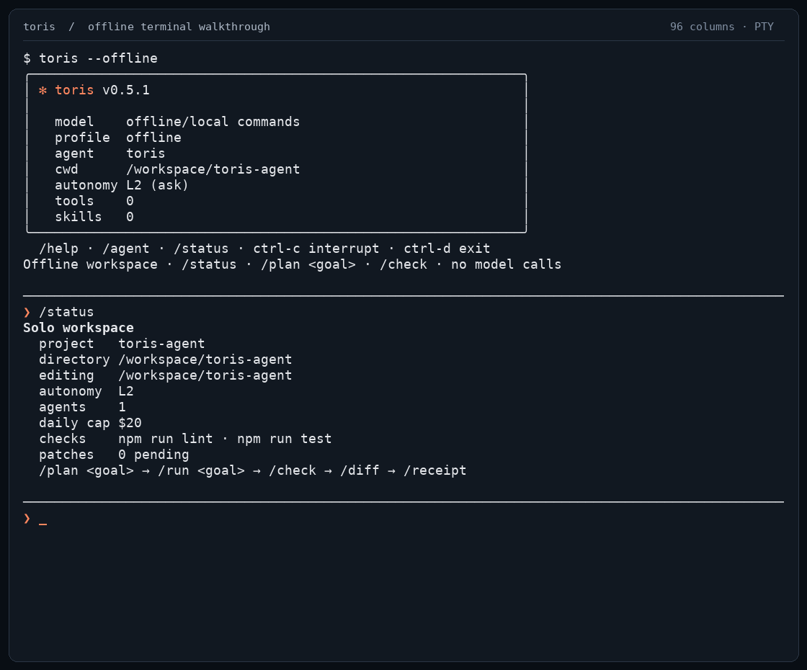
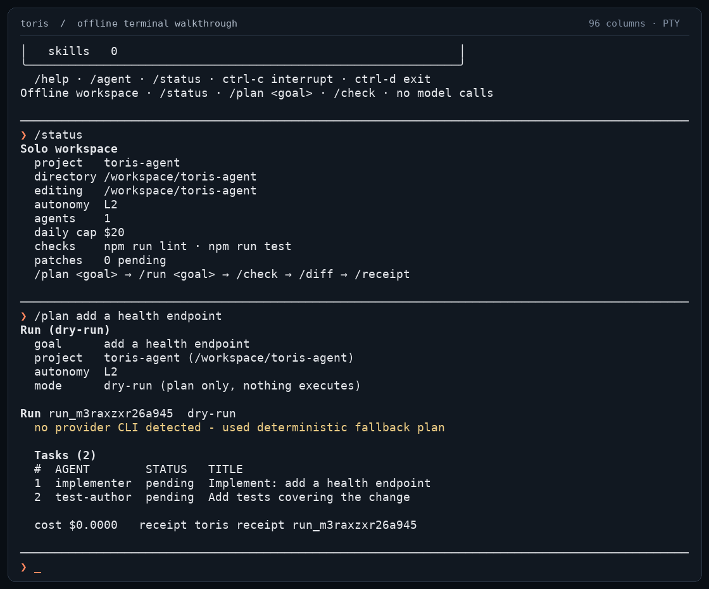
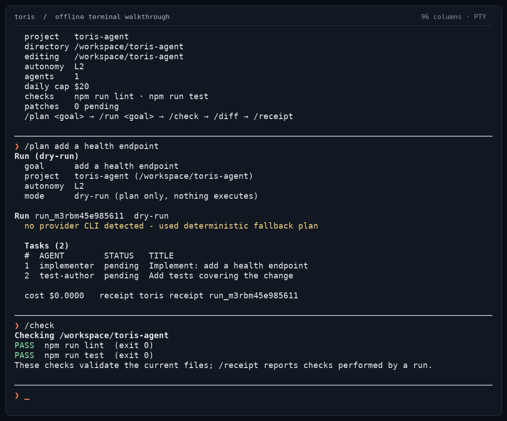

<div align="center">

# Toris Agent

**A local-first terminal harness for solo developers.**

Plan a small change, run your checks, review the diff, and keep the evidence.

[](https://github.com/torisKR/toris-agent/actions/workflows/ci.yml)
[](https://github.com/torisKR/toris-agent/releases)
[](https://nodejs.org)
[](./LICENSE)

</div>

Toris connects your repository, coding provider, checks, patches, and run receipts in one terminal workflow. Use the TUI for everyday work and the same CLI core for scripts and automation. There is no web Studio.

Your configured Claude Code or Codex CLI performs orchestrated coding tasks. Interactive chat also supports direct model APIs. Toris stores its own state locally under `~/.toris`; connected providers receive the prompts and context needed for your requests. Toris has no account, hosted control plane, or telemetry of its own.

<p align="center">
  
</p>

*Workspace status keeps the project, editing directory, policy, checks, and pending patches visible.*

## See the terminal workflow

<p align="center">
  <a href="docs/assets/readme/terminal-demo.mp4">
    
  </a>
</p>

[Watch the MP4](docs/assets/readme/terminal-demo.mp4) · [Download the terminal recording](docs/assets/readme/terminal-demo.cast)

The demo is a real offline terminal session: setup → status → deterministic plan → configured checks → receipt. It demonstrates the local workflow; it does not demonstrate successful AI coding. The receipt belongs to the dry run, and the independent checks are shown separately. Screenshots and recordings are in [`docs/assets/readme/`](docs/assets/readme/). The optional `.cast` download adds no runtime dependency to Toris.

## Install with Homebrew

After the public release and tap are available:

```bash
brew tap torisKR/tools
brew install torisKR/tools/toris-agent
cd /path/to/your-project
toris init --solo
toris --offline
```

The tap is [`torisKR/homebrew-tools`](https://github.com/torisKR/homebrew-tools). Its formula downloads the versioned archive from [GitHub Releases](https://github.com/torisKR/toris-agent/releases), checks its SHA256, and uses Homebrew's Node.js. It requires no npm install, native build, or model account for the offline workflow. Run `brew test torisKR/tools/toris-agent` to verify installation and `brew upgrade toris-agent` to update. See [release and tap maintenance](docs/RELEASING.md).

## Quickstart from source

Requires **Node.js 22.6 or newer**. The JavaScript CLI uses Node's standard library and runs from source without `npm install`. Git is required for isolated coding worktrees; a non-Git project can still use local status, planning, and checks.

```bash
git clone https://github.com/torisKR/toris-agent.git
cd toris-agent
node bin/toris.js --help
node bin/toris.js doctor
node bin/toris.js init --solo
node bin/toris.js --offline
```

This registers the checkout you are standing in. To use your own project, change to that project and run `node /absolute/path/to/toris-agent/bin/toris.js init --solo`, then the same path with `--offline`. Examples below use `toris` as shorthand for that command. An optional `npm link` from the source checkout creates the local `toris` command.

You can also extract the portable `.tgz` asset from a GitHub Release and run `node /absolute/path/to/package/bin/toris.js`. Node.js must be installed separately for this route. Source checkouts use Git updates; Homebrew installations use `brew upgrade`. The existing `toris update` command targets npm installations; this terminal renewal is distributed through GitHub Releases and Homebrew.

A fresh **`toris init --solo`** sets:

| Setting | Fresh solo preset |
| --- | --- |
| Autonomy | **L2**: edit, then manually apply |
| Agents | `maxParallelAgents: 1` |
| Daily run budget | `maxDailyCostUsd: 20` |
| Knowledge | `knowledge.autoRetrieve: true`; retrieval only |
| Chat backend | Detect an available `claude` or `codex` CLI and use its `auto` model |
| Project | Register the Git root, or current directory outside Git; infer checks |

Initialization checks CLI presence without logging in or calling a model. Existing saved configuration, model profiles, routing, and project checks are preserved; repeat initialization fills missing preferences without duplicating the project. Plain `toris init` retains the general configuration defaults, including L3 and three agents. Check `/status` for the policy actually active in your session.

## Everyday work in the TUI

Start with `toris --offline` to explore local operations without provider, authentication, or model calls. Configured checks still execute your project's commands. Offline prose and `/run` are refused; `/plan` always uses a deterministic fallback and executes no coding tasks.

```text
/status
/plan add a health endpoint
/check
/receipt
/exit
```

<p align="center">
  
</p>

*An offline plan previews task roles and creates a dry-run record. It does not edit your project or verify a change.*

For model-backed work, install [Claude Code](https://claude.com/claude-code) or [Codex CLI](https://developers.openai.com/codex/cli), complete that CLI's login, and put it on `PATH`. Then restart Toris normally. `toris doctor` reports missing prerequisites; solo initialization alone does not establish working authentication.

```bash
toris connect --provider claude-cli    # or codex-cli; reuse its CLI login
toris                                # interactive terminal session
```

```text
/status
/plan add a health endpoint
/run add a health endpoint
/check
/patches
/diff pat_<id>
/receipt
/apply pat_<id>
```

Read the check results and diff before applying. `/discard pat_<id>` drops a saved patch instead. Plain messages go to the selected chat model; `/run` uses the CLI orchestrator and creates a separate run receipt.

| TUI command | What it does |
| --- | --- |
| `/status` | Show project, editing directory, active policy, checks, and pending patches |
| `/plan <goal>` | Preview tasks without executing them; connected planning may call a provider |
| `/run <goal>` | Plan, execute, and check a registered project; requires a provider CLI |
| `/check` | Execute checks against the current editing files |
| `/diff [id]` | Read the current diff or a saved patch |
| `/receipt [runId]` | Read the requested run, or this session's last plan/run; fall back to the latest saved run |
| `/agent [id]`, `/model [profile]` | List or switch the role and chat model profile |
| `/autonomy [L1-L5]` | Inspect or change the session policy |
| `/skills`, `/tools`, `/knowledge [query]` | Inspect tools, skills, and local knowledge |
| `/reflect [runId\|accept]` | Propose a note from verified run evidence, then explicitly accept it |
| `/patches`, `/apply [id]`, `/discard [id]` | Review and settle isolated changes |
| `/usage`, `/clear`, `/help`, `/exit` | Inspect session usage, clear the transcript, get help, or leave |

`/check` uses the active editing directory: after `/run`, its pending worktree; after a plain chat turn, the live chat worktree if one exists, otherwise the current directory. An applied run uses the project checkout. `/status` shows the target, and `/diff` follows the same run or chat focus. `/receipt` reports checks performed by that run; running `/check` independently does not add evidence to a receipt or turn a dry run into a verified implementation.

For live CLI chat changes, `/diff` inspects the live worktree. `/apply` or `/discard` without an ID settles that live session; restart `toris` afterward to continue model-backed chat in a fresh session.

## Checks and evidence

<p align="center">
  
</p>

*Checks execute real commands and show their exit codes. A project with no checks remains unverified.*

Toris detects Node scripts in order (`typecheck`, `lint`, `test`, `build`), `cargo test`, `go test ./...`, pytest when project configuration mentions it, and a declared `make test` target as a fallback. Checks run in order and stop at the first failure. Detection does not install your project's tools or dependencies.

Use explicit checks for a monorepo, a different package manager, or a custom validation workflow. Run `toris project list`, then edit the existing project's `checks` array in `~/.toris/projects.json`, preserving its other fields. For example:

```json
{
  "checks": ["pnpm lint", "pnpm test", "pnpm build"]
}
```

This is an excerpt of the existing project record, not a replacement for the projects collection. Nonempty configured checks take precedence over detection. Restart the TUI after changing configuration.

Receipts record the goal, task outcomes, check results, failures, review outcome, duration, cost, and changed files. A dry run or a run with no checks says **nothing verified**. When the opposite CLI is available, an orchestrated run can review the isolated diff; a failing review holds automatic apply. Unavailable or skipped reviews are reported. `--no-review` explicitly skips this pass.

## CLI and automation

```bash
toris project list
toris project add /path/to/project
toris run "add a health endpoint" -p <projectId> --dry-run --offline
toris run "fix the parser" -p <projectId> --autonomy L2 --budget 2.00
toris patches
toris diff <patchId>
toris apply <patchId>                 # or: toris discard <patchId>
toris runs
toris inspect <runId>
toris receipt <runId> --md > receipt.md
toris receipt <runId> --json
toris logs <runId>
toris cost today --json
toris brief today --json
```

`--json` provides machine-readable output; `--home <dir>` chooses a separate state directory. Exit codes: `0` success, `1` failure, `2` usage error, `3` verification failure, `4` approval or manual apply pending, `5` daemon unavailable. A successful dry run means a plan was produced, not that checks passed.

The daily cap guards **orchestrated runs**, including `/run` and daemon jobs, using the local cost ledger and provider-reported costs. `--budget` sets a per-run ceiling. These guards stop new work when the recorded cap is reached; they are not a billing guarantee and do not cap interactive chat. Use `/usage` for chat usage and your provider's billing controls for account-wide limits. A cap of `0` is unlimited.

## Autonomy and editing boundaries

| Level | Run policy |
| --- | --- |
| L1 | Plan only |
| **L2** | Write isolated edits; hold the patch for manual apply |
| L3 | Automatically apply isolated edits; permit local commits; push requires approval |
| L4 | Also permit pushes to a side branch |
| L5 | Also permit pushes to the default branch |

L2 is the fresh solo preset. Saved `defaultAutonomy`, `--autonomy`, and `/autonomy` determine your actual policy. `toris autonomy` explains the ladder. `--apply` explicitly bypasses the L2 apply hold for a run; queued approvals use `toris approvals`, `approve`, and `reject`.

Orchestrated CLI runs and CLI-backed chat create Git worktrees when the project is a Git repository. A non-Git project cannot provide that isolation. **Direct API chat tools operate in the original checkout**: mutating tools ask below L3 and are automatically approved at L3 or higher. CLI-backed chat delegates tool approvals to the provider CLI. Choose the backend and policy with these differences in mind; a worktree is not a sandbox for arbitrary commands.

The baseline terminal workflow needs no messaging tokens and does not publish your work. Higher autonomy widens Git permissions. Configured optional Slack or Telegram bindings can send existing patch notices; supplying those credentials opts into that integration.

## Models, agents, and skills

Chat supports `claude-cli`, `codex-cli`, `anthropic`, `openai`, and `grok`. CLI profiles use `auto` unless you select a model. API profiles require a concrete model ID and the corresponding environment key: `ANTHROPIC_API_KEY`, `OPENAI_API_KEY`, or `XAI_API_KEY` (`GROK_API_KEY` also works). Toris does not hardcode model IDs.

```bash
toris connect --provider openai --model <model-id> --name main
toris chat --profile main "explain the failing test"
toris --agent implementer
toris agents --category build
toris skills
```

API credentials belong in environment variables. Profiles and routing live in `~/.toris/config.json`. API chat does not replace the provider CLI needed by `/run` and `toris run`.

Add roles in `.toris/agents/<id>.json`; home overlays live in `~/.toris/agents/`, with project definitions taking precedence. Skills are directories containing `SKILL.md`, discovered from built-ins, `~/.toris/skills`, and project `.toris/skills`. CLI-backed providers run their own tool and skill loops. See [agent profiles](docs/AGENTS.md).

## Local state and optional tools

State lives under `~/.toris`, or `$TORIS_HOME` / `--home`: `config.json`, `projects.json`, `runs/`, `events/` JSONL, `cost.json`, `patches.json`, `patches/`, and Git `worktrees/`. Optional tools add `knowledge/`, daemon records and inboxes, and Android evidence. You can inspect these local files directly.

- **Knowledge:** `toris knowledge init`, `knowledge search <query>`, and opt-in `knowledge pack install <slug>`. Automatic retrieval reads existing knowledge; `/reflect` proposes a note and `/reflect accept` writes it explicitly. Disable retrieval with `toris chat --no-knowledge`. [Knowledge guide](docs/KNOWLEDGE.md).
- **Daemon:** `toris daemon start`, `daemon run "<goal>"`, `daemon schedule add "@daily" "<goal>" --dry-run`, and `daemon stop`. A local worker executes queued runs and schedules; it is optional for foreground work. [Daemon guide](docs/DAEMON.md).
- **Android:** `toris android status`, `devices`, `screenshot`, `logcat`, or `install app.apk`; requires `adb` for device operations. Screenshots and logs stay in the local Android store.
- **Bots:** `toris bot` enables configured Slack Socket Mode or Telegram polling. Set the channel credentials, workspace, and sender allowlists first. Starting the bot enables external replies; it is optional and never started by solo initialization.
- **Digest:** `toris brief` reads today's runs, spend, daemon status, and available knowledge. [Brief guide](docs/BRIEF.md).

## Development

```bash
npm test                             # built-in Node test runner
npm run lint                         # JavaScript syntax checks
node --test test/solo-setup.test.js test/tui-harness.test.js test/tui-offline.test.js
npm pack --dry-run                    # inspect the package contents
node bin/toris.js --help
node scripts/build-release.js --out /tmp/toris-agent-release
```

The JavaScript workflow needs no dependency installation or build step. Optional native acceleration has platform packages and a Rust build (`npm run build:native`); the JavaScript fallback remains available.

See [CONTRIBUTING.md](CONTRIBUTING.md), the [CLI contract](docs/CONTRACT.md), [module specifications](docs/specs/), [recording the demo](docs/MEDIA.md), and [CHANGELOG.md](CHANGELOG.md). Report vulnerabilities using [SECURITY.md](SECURITY.md).

[Apache-2.0](LICENSE) © toris
